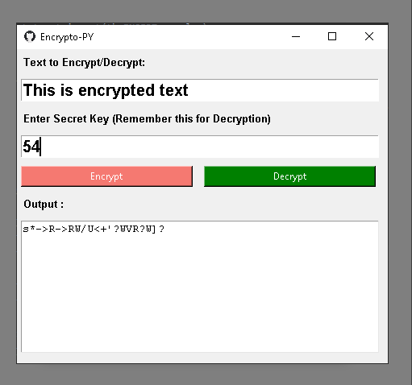

# encrypto-py
Python GUI Encrytion/Decrytion tool to keep file safe.

__________________________________________________________________________
**Usage**

1. Open your Terminal/cmd

2. git clone this project to your preferred directory.

3. `cd encryoto-py`

4. `python encryoto.py`

__________________________________________________________________________
**Requirements:**
Tkinter

