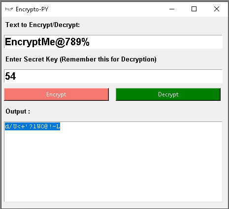

# Encrypto-GUI
Python GUI Encrytion/Decrytion tool to keep file safe.

__________________________________________________________________________
**Usage**

1. Open your Terminal/cmd

2. git clone this project to your preferred directory.

3. `cd Encrypto-GUI`

4. `python encrypto.py`

<br/>
or Execute:
```
ExecuteEncrypto.cmd
```



__________________________________________________________________________
**License**

This project is licensed under the terms of the [MIT license](https://github.com/nagracks/organizer/blob/master/LICENSE).
